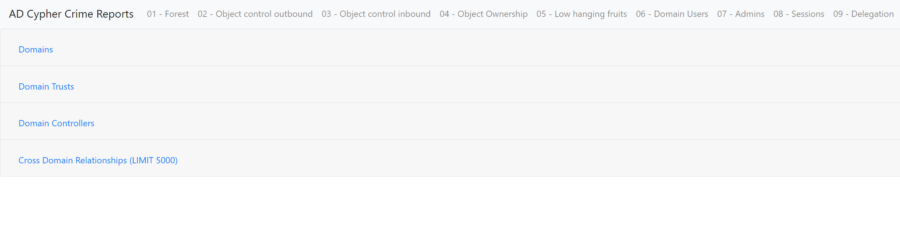

# ADCypherCrime

## Description
ADCypherCrime is a Python-based tool designed to execute a series of Cypher queries on a Neo4j database and output the results in nicely formatted HTML files. This tool is particularly useful for AD security analysts and IT-Administrators who require a quick and efficient way to get an overview on potential security issues within their Active Directory environment.

You may ask yourself, why did I port it to from PowerShell to python? ... Because PowerShell did bring insonsistent results and was slow AF. On top of that i wanted to protect myself from insanity. 

New features in the ported version:
- Using the bolt protocol instead of the API
- Better code readability
- Runs like 10x faster now

## Features
- Execute multiple Cypher queries from a JSON file.
- Output results in well-formatted HTML files.
- Categorize and separate query results based on specified categories.

## Installation
To set up ADCypherCrime on your system, follow these steps:

1. Clone the repository:
   ```bash
   git clone https://git.vie.sec-consult.com/mri/cyphercrimepy.git
   ```
2. Navigate to the project directory:
   ```bash
   cd cyphercrimepy
   ```
3. Install the required dependencies:
   ```bash
   pip install -r requirements.txt
   ```

## Usage
Run the script from the command line, specifying the necessary parameters. Here's an example:

```bash
python cyphercrime.py --url neo4j://localhost:7687 --query_file neo4j_queries.json --username neo4j --out_path Report
```

## Parameters

```bash
usage: cyphercrime.py [-h] [--url URL] [--query_file QUERY_FILE] [--username USERNAME] [--password PASSWORD] [--out_path OUT_PATH]

Script to execute Cypher queries on a Neo4j database.

options:
  -h, --help            show this help message and exit
  --url URL             URL for connecting to the Neo4j database. Defaults to "neo4j://localhost:7687".
  --query_file QUERY_FILE
                        Path to the JSON file containing the Cypher queries. Defaults to "neo4j_queries.json".
  --username USERNAME   Username for the Neo4j database. Defaults to "neo4j".
  --password PASSWORD   Password for the Neo4j database. If not provided, the script will prompt for it.
  --out_path OUT_PATH   Output directory path where the results will be stored. Defaults to a directory named "Report".
```

## Requirements
- Neo4j Python driver
- Colorama for colored console output

## Screenshot



